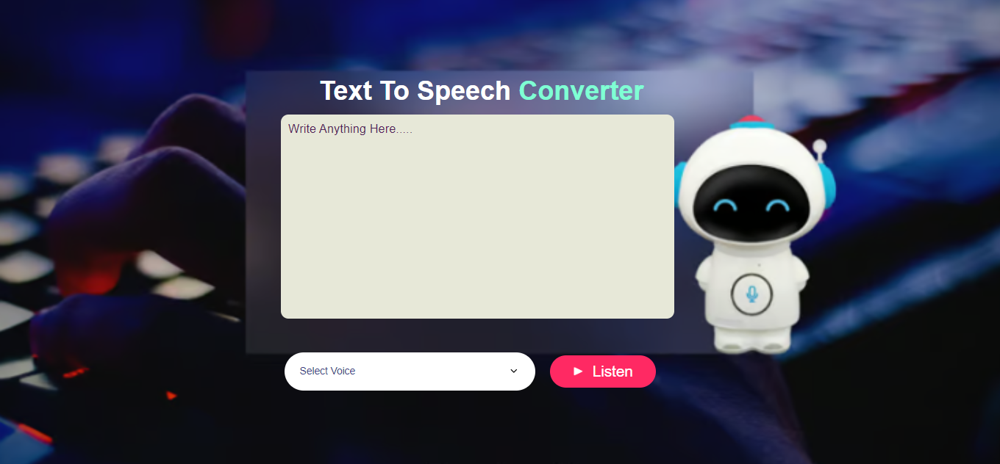
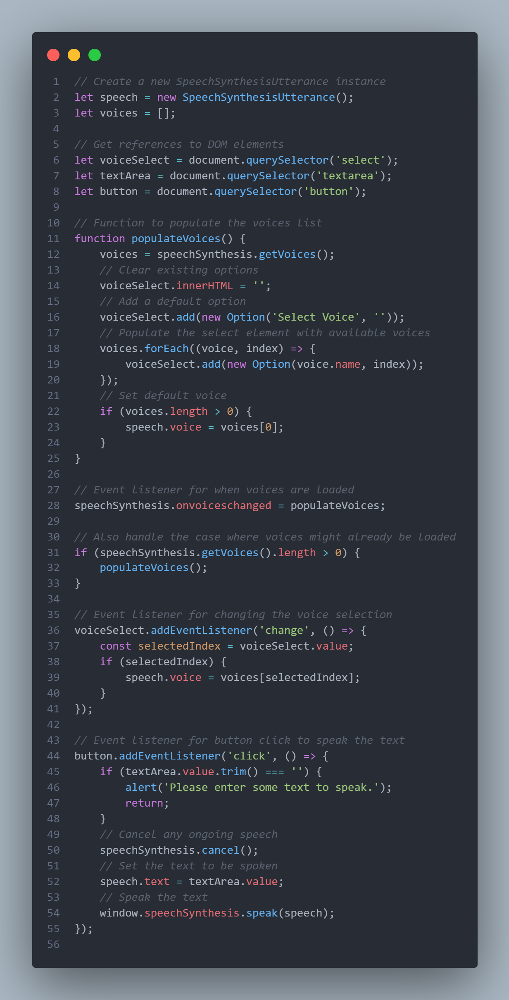

# 🌟 Text-to-Speech Converter 🌟
  
Welcome to the **Text-to-Speech Converter**! 🚀 This interactive web application brings your text to life with voice synthesis, powered by the Web Speech API. Whether you’re looking to hear your words spoken out loud or test various voice options, this tool provides an intuitive and stylish experience.

## 📸 Preview

### **Application Screenshot**

### **Video Demo**

Check out the demo video to see the Text-to-Speech Converter in action!

## 🚀 Features

- **Instant Text-to-Speech Conversion**: Simply enter your text and click "Listen" to hear it spoken aloud.
- **Voice Customization**: Select from a variety of voices to match your preferred accent or style.
- **Responsive Design**: Enjoy a sleek and modern interface that works beautifully on any device.

## 🛠️ How to Use

1. **Enter Your Text**: Type or paste the text you wish to convert in the provided textarea.
2. **Choose a Voice**: Select a voice from the dropdown menu to customize the speech output.
3. **Click 'Listen'**: Hit the "Listen" button to hear your text spoken in the selected voice.

## 🧩 Technologies Used

- **HTML5**: Structuring the content.
- **CSS3**: Styling the application with a modern, responsive design.
- **JavaScript**: Implementing speech synthesis using the Web Speech API.

## 💡 Code Highlights
Here's a glimpse of the core functionality in JavaScript:

📬 Contact
Feel free to reach out for questions or feedback: touhidarahimu30@gmail.com

